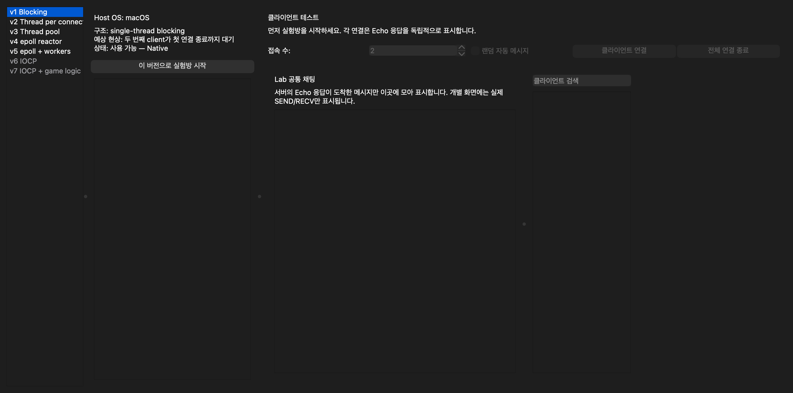
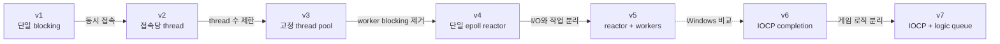

# MMO Server Architecture Lab

C++ 네트워크 서버를 v1부터 단계적으로 구현하고, GUI에서 버전별 동시성 구조와 동작 차이를 직접 비교하는 학습 프로젝트입니다.



## 버전별 구조

| 버전 | 구조 | 상태 |
|---|---|---|
| v1 | [단일 스레드 blocking TCP](server/v1/README.md) | 완료 |
| v2 | [thread-per-connection](server/v2/README.md) | 완료 |
| v3 | [고정 thread pool + bounded queue](server/v3/README.md) | 완료 |
| v4 | [단일 epoll reactor](server/v4/README.md) | 완료 |
| v5 | [epoll reactor + worker pool](server/v5/README.md) | 완료 |
| v6 | [Windows IOCP completion I/O](server/v6/README.md) | 완료 |
| v7 | IOCP + game logic queue | 예정 |



## 운영체제별 실행 범위

| 호스트 | Native | Docker | 실행 불가 또는 미구현 |
|---|---|---|---|
| macOS | v1~v3 | v4~v5 | v6, v7 |
| Linux | v1~v5 | 필요 없음 | v6, v7 |
| Windows | v6 | 현재 GUI에서 미지원 | v1~v5, v7 |

v4~v5는 Linux의 `epoll`과 `eventfd`, v6는 Windows의 Winsock2와 IOCP를 사용하므로 플랫폼별 실행 범위가 다릅니다. 선택할 수 없는 버전도 구조와 설명은 GUI에서 확인할 수 있습니다.

## 빌드 구조

- 서버 빌드: `build/server`
- GUI 빌드: `build/server_lab`
- macOS 앱: `MMO Server Lab.app`
- Windows 실행 파일: `build/server_lab/Release/MMO Server Lab.exe`
- 표준: C++20
- GUI: Qt Widgets + Qt Network

`start.sh`와 `start.ps1`은 CMake 설정, 변경된 대상 빌드, 테스트, Qt 배포와 GUI 실행을 순서대로 처리합니다. 기존 빌드가 있으면 CMake의 증분 빌드를 사용합니다.

## 상세 문서

- [개발 로드맵](basicdata/roadmap.md)
- [버전별 벤치마크](basicdata/benchmark.md)
- [문제 재현과 해결 기록](basicdata/troubleshooting.md)
- [학습 내용](basicdata/learnings.md)
- [구현 피드백](basicdata/feedback.md)

## 빠른 시작

저장소를 clone한 뒤 운영체제에 맞는 실행 파일을 사용합니다.

### macOS

Finder에서 `Start Server Lab.command`를 더블클릭하거나 터미널에서 실행합니다.

```bash
./start.sh
```

Qt가 없으면 Homebrew로 설치합니다. Docker가 준비되어 있으면 Linux 전용 v4~v5 이미지도 자동으로 빌드합니다. 처음 실행할 때는 Qt 배포와 앱 서명 때문에 시간이 걸릴 수 있으며, CLI에 현재 단계와 경과 시간이 표시됩니다.

### Linux

```bash
./start.sh
```

지원하는 패키지 관리자에서는 Qt 개발 패키지를 자동으로 설치합니다. GUI가 필요하므로 데스크톱 환경이 있어야 합니다.

### Windows

`Start Server Lab.bat`을 더블클릭하거나 PowerShell에서 실행합니다.

```powershell
.\start.ps1
```

Qt가 없으면 프로젝트의 `.tools/Qt` 아래에 자동으로 설치하고 `windeployqt`로 실행 파일에 필요한 구성요소를 배포합니다.

빌드와 테스트만 실행하고 GUI를 띄우지 않으려면 다음 명령을 사용합니다.

```bash
./start.sh --no-launch
```

## GUI 사용법

1. 왼쪽 목록에서 서버 버전을 선택합니다.
2. 구조, 예상 현상과 현재 OS에서의 실행 가능 여부를 확인합니다.
3. `이 버전으로 실험방 시작`을 누릅니다. 실행 파일이 없으면 선택한 버전을 자동으로 빌드합니다.
4. 오른쪽에서 접속할 클라이언트 수를 지정하고 `클라이언트 연결`을 누릅니다.
5. 클라이언트 목록에서 항목을 선택해 직접 전송, 지연 1회 전송 또는 반복 전송을 시험합니다.
6. 실행 중인 서버는 `방 종료` 버튼으로 정리합니다.

클라이언트가 많아져도 창이 늘어나지 않도록 고정 너비 목록과 세로 스크롤을 사용합니다. `●`는 연결 상태, `○`는 연결 종료 상태이며 검색창에서 클라이언트 번호를 찾을 수 있습니다.

`랜덤 자동 메시지`를 선택하면 각 클라이언트에 테스트 메시지, 1~5초 간격, 지연 1회 또는 반복 전송 방식이 무작위로 지정됩니다.

### 공통 채팅 화면의 의미

v1~v6은 채팅 서버가 아니라 TCP Echo 서버입니다. `Lab 공통 채팅`은 서버의 Echo 응답이 실제로 도착한 메시지만 시간순으로 모아 보여주는 집계 화면입니다. 개별 클라이언트 화면에는 해당 소켓의 실제 `SEND`, `RECV`, `ERROR`만 표시하므로 서버가 다른 클라이언트에게 메시지를 방송하는 것처럼 보이지 않습니다.

예를 들어 v1에서 Client 1이 연결된 동안 Client 2가 메시지를 보내면 `SEND`는 기록될 수 있지만 Echo 응답은 오지 않습니다. Client 1을 종료해 서버가 다음 연결을 처리해야 Client 2의 응답이 공통 채팅에 나타납니다.
