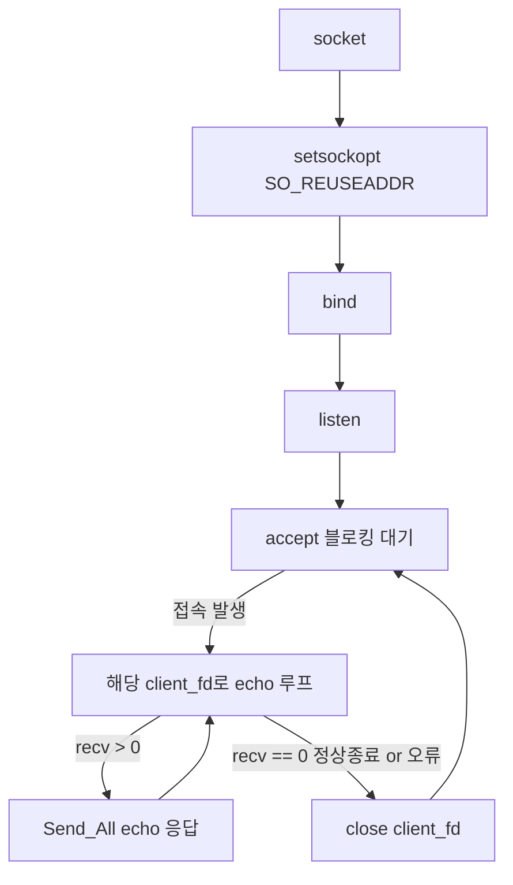
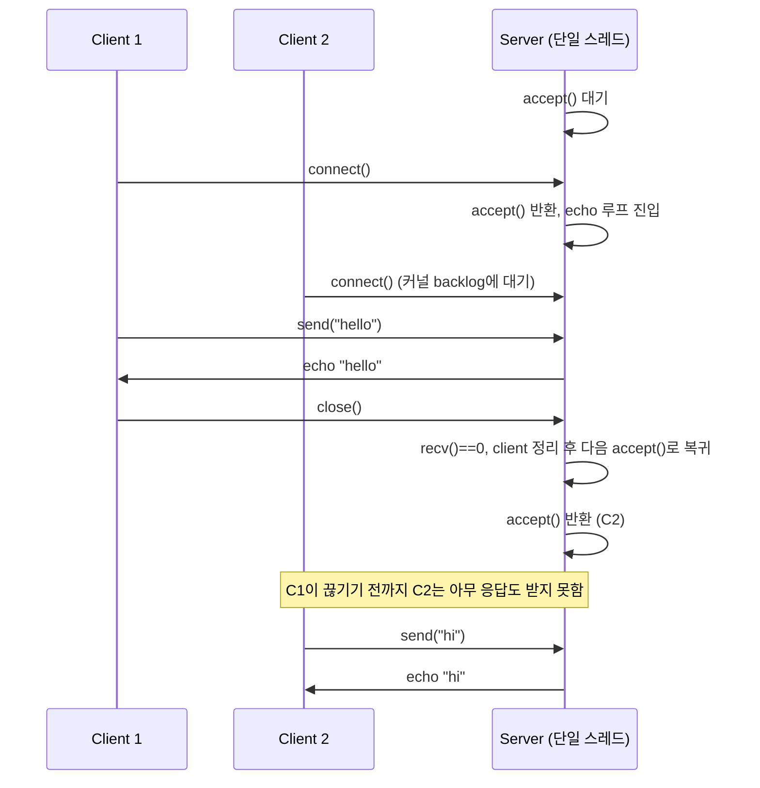

# v1 — 싱글 스레드 blocking TCP 서버

## 목표

동시성을 전혀 도입하지 않은 상태에서 소켓 API 자체(`socket` → `bind` → `listen` → `accept` → `recv`/`send` → `close`)의
기본 흐름을 익히는 baseline 버전이다. 이후 모든 버전이 비교 기준으로 삼는 출발점.

## 구성 파일

- [include/blocking_echo_server.h](include/blocking_echo_server.h)
- [src/blocking_echo_server.cpp](src/blocking_echo_server.cpp)
- [src/main.cpp](src/main.cpp)

## 한눈에 보기

| 항목 | 현재 구현 |
|---|---|
| 동시성 | 없음, main thread 1개 |
| 접속 처리 | 한 client 연결이 끝난 뒤 다음 `accept()` |
| I/O | blocking `accept/recv/send` |
| 전송 | `Send_All()`로 partial send와 `EINTR` 처리 |
| 의도된 한계 | 느리거나 오래 연결된 client 하나가 전체 서버를 점유 |

## 핵심 구조

`BlockingEchoServer` 클래스 하나가 listen 소켓을 소유하고, `Server_Run()` 안에서 **accept 루프 → (그 클라이언트만을 위한) echo 루프**를
순차적으로 실행한다. 스레드가 하나뿐이므로 한 클라이언트를 처리하는 동안(`recv()` 대기 포함) 다음 클라이언트의 `accept()`는
커널 backlog 큐에 쌓이기만 하고 실행되지 않는다 — 이 한계를 직접 관찰하는 것이 v1의 QA 포인트다.

## 시퀀스: 클라이언트 2개가 접속을 시도할 때

blocking 구조의 한계를 그대로 보여주는 흐름 — 두 번째 클라이언트는 첫 번째가 끝날 때까지 응답을 받지 못한다.

## 구현 포인트

- **`Send_All()`**: `send()`의 partial send에 대비해 실제 전송 바이트 수를 누적하고, 남은 범위만 반복 전송한다.
  `EINTR`는 같은 범위로 재시도하고, 그 외 실패는 호출부에 알려 연결을 닫는다.
- **`recv()` 결과 3분기**: `> 0`(데이터), `== 0`(정상 FIN 종료), `< 0`(오류, 그중 `EINTR`은 재시도)을 분리해 처리한다.
- **`SO_REUSEADDR`**: `bind()` 전에 설정해 서버 재시작 시 같은 포트 바인딩 실패를 방지한다.
- **리스닝 소켓 vs 클라이언트 소켓 분리**: 클라이언트 연결 정리 시 실수로 리스닝 fd를 닫으면 이후 `accept()`가 전부 실패하므로,
  리스닝 fd는 소멸자에서만 닫는다.

## 테스트/QA

- `nc`/`telnet`으로 단일 접속 echo 확인
- 두 번째 클라이언트가 첫 번째 처리가 끝날 때까지 멈춰있는지 확인 (blocking 한계 체감)

## 이 구조의 한계 (다음 버전에서 해결)

- 한 커넥션이 다른 모든 커넥션의 처리를 막는다 → v2에서 thread-per-connection으로 해결
