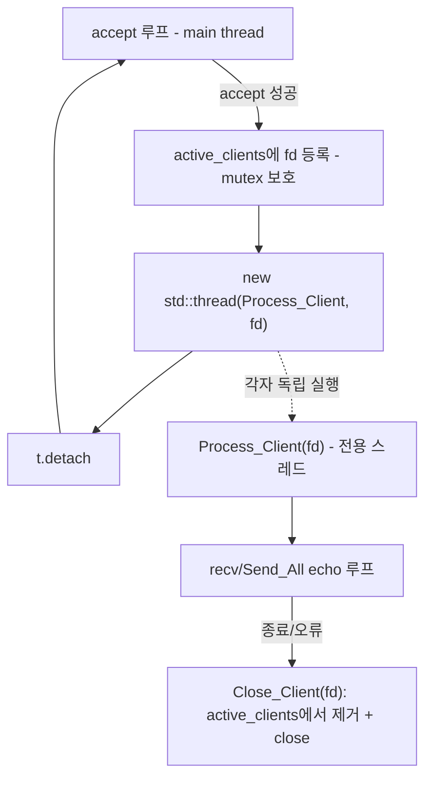
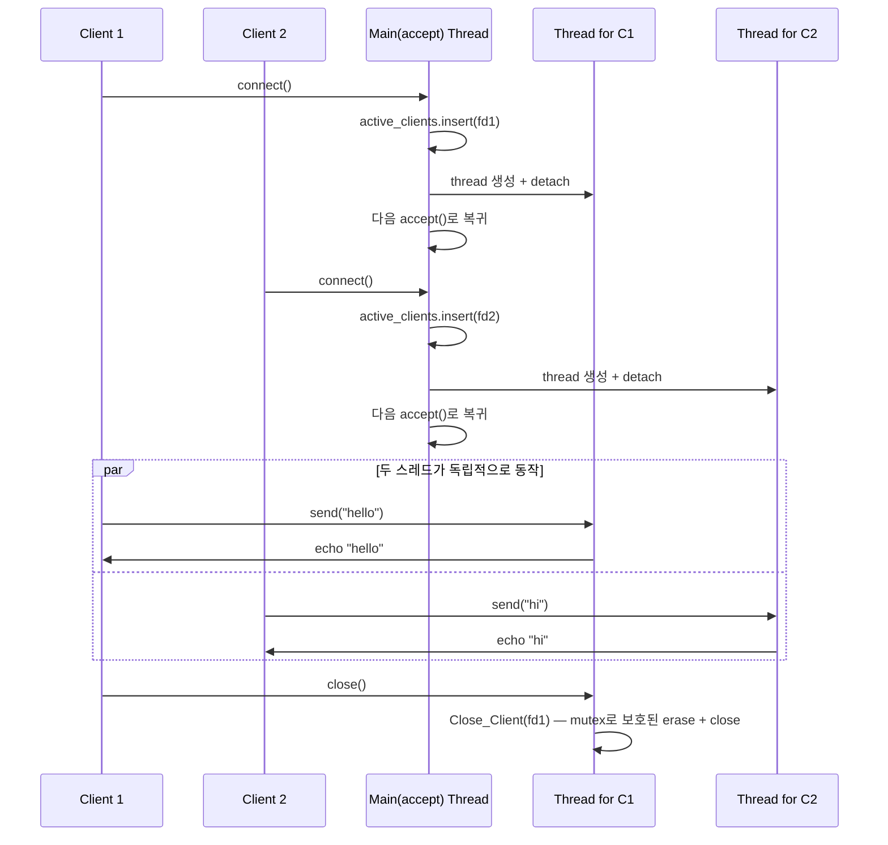

# v2 — thread-per-connection

## 목표

접속마다 `std::thread`를 하나씩 생성해 동시성을 확보한다. 기본적인 스레드 생성/분리(`detach`)와
공유 자원 보호(`std::mutex`), race condition에 대한 감각을 익히는 버전.

## 구성 파일

- [include/thread_connection_server.h](include/thread_connection_server.h)
- [src/thread_connection_server.cpp](src/thread_connection_server.cpp)
- [src/main.cpp](src/main.cpp)

## 한눈에 보기

| 항목 | 현재 구현 |
|---|---|
| 동시성 | client 연결마다 detached thread 1개 |
| accept 역할 | client fd 등록과 thread 생성 후 즉시 다음 접속 대기 |
| 공유 상태 | `active_clients`, mutex로 보호 |
| 전송 | client thread가 `Send_All()` 수행 |
| 의도된 한계 | 접속 수만큼 thread 증가, 종료 시 detached thread 회수 불가 |

## 핵심 구조

accept 스레드(메인 스레드)는 `accept()`로 연결을 받자마자 활성 클라이언트 목록(`active_clients`, mutex로 보호)에 등록하고,
그 client_fd를 처리할 `std::thread`를 만들어 `Process_Client()`에 넘긴 뒤 즉시 `detach()`한다. accept 스레드는 그 커넥션의
echo 처리를 기다리지 않고 바로 다음 `accept()`로 돌아가므로, v1과 달리 여러 클라이언트가 동시에 처리된다.

## 시퀀스: 두 클라이언트 동시 접속

thread-per-connection 덕분에 C2가 C1의 echo를 기다리지 않는다.

## 구현 포인트

- **멤버 함수 포인터 스코프**: `std::thread`에 비정적 멤버 함수를 넘길 때는 `&ClassName::MemberFunc` 형태로 명시해야 한다.
  (`thread t(&ThreadPerConnectionEchoServer::Process_Client, this, fd)`)
- **공유 자원 보호**: `active_clients`(`std::unordered_set<int>`)는 accept 스레드와 각 client 스레드가 동시에 접근하므로
  모든 접근을 `active_clients_mutex`로 감싼다. `Close_Client()`는 `erase()`와 `close()`를 같은 임계 영역에서 처리해,
  fd 번호가 재사용되는 타이밍에 다른 스레드가 새 연결 기록을 잘못 지우는 race를 막는다.
- **`detach()`의 트레이드오프**: 스레드 수명 관리를 포기하는 대신 구현이 단순해진다. 서버가 종료돼도 detach된 스레드를
  기다리거나 회수할 수 없다는 한계를 의도적으로 유지해 v3와 비교한다.
- **버퍼 로그 처리**: `recv()` 버퍼는 널 종료가 보장되지 않으므로 `std::string(buffer, recv_result)`처럼 길이를 명시해 감싼다.

## 테스트/QA

- 여러 클라이언트 동시 접속 후 병렬 echo 확인
- 급격한 접속/종료 반복 시 스레드/fd 누수 확인 — 최대 10개씩 병렬로 50개 접속·종료 반복 성공, 활성 count 0 복귀 확인

## 이 구조의 한계 (다음 버전에서 해결)

- 접속 수만큼 스레드가 계속 생성되어 스레드 생성 비용·스택 메모리가 누적 → v3에서 고정 크기 thread pool로 해결
- detach된 스레드는 서버 종료 시 회수할 수 없음(수명 관리 불가) → v3에서 worker를 컨테이너가 소유하고 `join()`
