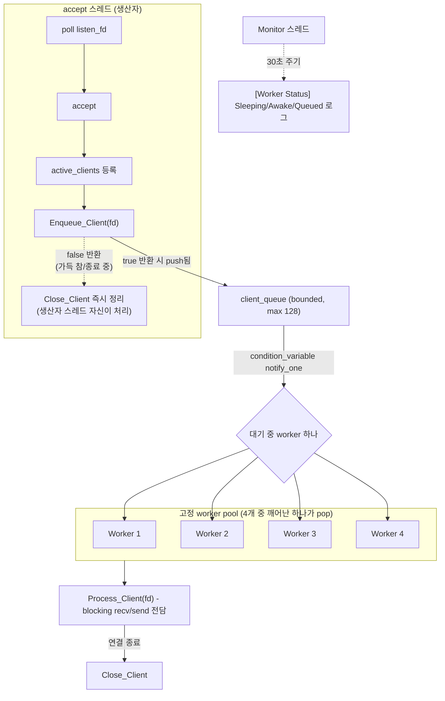
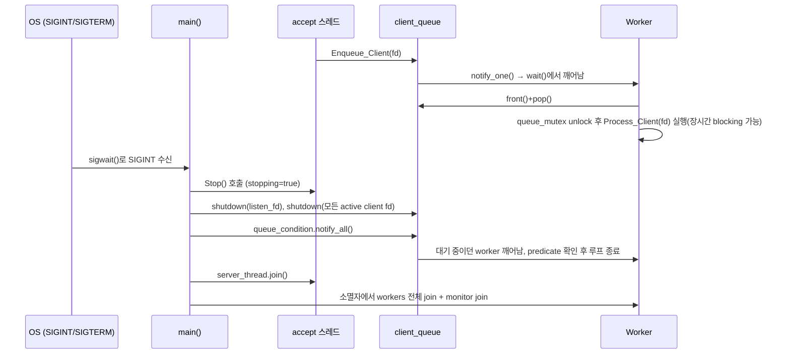

# v3 — 고정 크기 thread pool + bounded 작업 큐

## 목표

스레드 개수를 접속 수와 분리한다. 생산자-소비자 패턴, `std::condition_variable`을 이용한 작업 큐,
graceful shutdown(시그널 처리 + join 순서)을 학습하는 버전.

## 구성 파일

- [include/thread_pool_echo_server.h](include/thread_pool_echo_server.h)
- [src/thread_pool_echo_server.cpp](src/thread_pool_echo_server.cpp)
- [src/main.cpp](src/main.cpp)

## 한눈에 보기

| 항목 | 현재 구현 |
|---|---|
| 생산자 | accept/server thread 1개 |
| 소비자 | 고정 worker 4개 |
| 작업 단위 | client fd 하나, 연결 종료까지 worker가 전담 |
| 대기열 | 공용 bounded queue, 최대 128개 |
| 보조 thread | 30초 주기의 worker monitor |
| 의도된 한계 | 장기 연결 4개가 모든 worker를 점유할 수 있음 |

## 핵심 구조

accept 스레드는 이제 클라이언트를 직접 처리하지 않고, 받은 client_fd를 bounded 작업 큐(`client_queue`, 최대 128개)에
넣는 **생산자** 역할만 한다. 서버 시작 시 미리 만들어둔 고정 개수(4개)의 worker 스레드가 큐에서 fd를 꺼내
연결이 끝날 때까지 전담 처리하는 **소비자** 역할을 한다. 큐가 비어 있으면 worker는 busy-wait 없이
`condition_variable::wait()`로 잠들고, 새 작업이 들어오면 `notify_one()`으로 하나만 깨운다.
별도 monitor 스레드가 30초 주기로 sleeping/awake/queued 상태를 로그로 남긴다.

## 시퀀스: 큐잉과 종료(graceful shutdown)

## 구현 포인트

- **bounded queue**: 최대 128개로 제한하고, 초과 시 `Enqueue_Client()`가 `false`를 반환 → accept 스레드가 해당 연결을 즉시 닫는다.
  worker보다 빠르게 연결이 유입될 때 fd가 무한정 누적되는 걸 방지.
- **`condition_variable::wait()`의 동작**: 대기 중엔 mutex를 풀어 생산자가 큐에 접근할 수 있게 하고, 깨어난 뒤 mutex를
  다시 획득한 상태에서 predicate를 재확인한다 — 그래서 "큐 확인 + pop"을 하나의 임계 영역으로 유지할 수 있다.
- **worker는 blocking `recv()`로 연결 수명 전체를 점유**: 큐에서 fd를 꺼내는 순간에만 lock을 잡고, 실제
  `Process_Client()` 실행 전에는 lock을 풀어 다른 worker가 큐에 접근하도록 한다. (이 "연결 하나가 worker 하나를
  통째로 점유"하는 구조가 v3의 의도된 핵심 한계이며 v4의 epoll에서 해결한다.)
- **graceful shutdown**: listen fd를 non-blocking + `poll()` timeout 100ms로 만들어 macOS에서 `shutdown()`만으로
  `accept()`가 풀리지 않는 플랫폼 차이를 우회했다. SIGINT/SIGTERM은 main 스레드의 `sigwait()`에서 동기 처리(시그널
  핸들러 안에서 mutex/condition_variable을 만지면 안 되므로).
- **monitor의 `wait_for()`**: 고정 `sleep_for(30초)` 대신 조건변수의 `wait_for()` + 종료 predicate를 사용해, 평상시엔
  30초 주기를 유지하면서 종료 시엔 `notify_all()`에 즉시 반응한다.

## 테스트/QA

- 워커 수(4개) 초과 접속 시 큐잉 확인 — 장기 연결 140개 중 worker 4개 처리 + 큐 128개 대기, 초과 8개 거부
- CPU 사용률로 idle worker의 busy-wait 없음 확인
- 활성 연결 6개 상태에서 `Ctrl+C` 시 3초 이내 정상 종료 확인

## 이 구조의 한계 (다음 버전에서 해결)

- worker가 blocking `recv()`로 연결 수명 전체를 점유 → 장기 연결이 worker 4개를 다 차지하면 이후 연결은 큐에서
  무한정 대기 → v4의 epoll 기반 event loop(readiness 모델)로 해결
