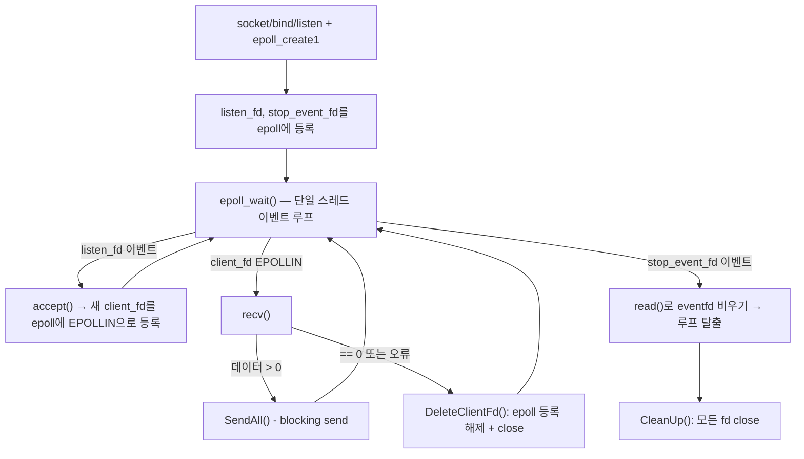
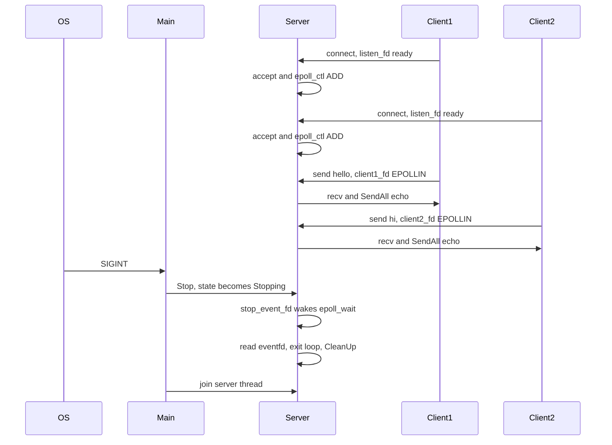

# v4 — epoll 기반 이벤트 루프 (단일 스레드 reactor)

## 목표

I/O multiplexing으로 여러 소켓을 하나의 이벤트 루프에서 감시하고, v3의 "연결마다 스레드/worker가 blocking으로
점유"하는 구조 대신 **readiness 기반**(준비된 fd만 처리) 흐름을 체감하는 버전. Linux 전용 API(`epoll`)를 사용하므로
배포 타겟인 Linux(Docker Ubuntu 24.04)에서 빌드/검증한다.

## 구성 파일

- [include/epoll_echo_server.h](include/epoll_echo_server.h)
- [src/epoll_echo_server.cpp](src/epoll_echo_server.cpp)
- [src/main.cpp](src/main.cpp)

## 한눈에 보기

| 항목 | 현재 구현 |
|---|---|
| 이벤트 모델 | readiness (`epoll`) |
| I/O thread | server/reactor thread 1개 |
| 감시 대상 | listen fd, client fd, stop event fd |
| client I/O | level-triggered `EPOLLIN`, blocking `recv/SendAll` |
| 종료 깨우기 | `eventfd`를 epoll에 등록하고 `Stop()`에서 write |
| 의도된 한계 | 느린 client의 blocking 송신이 reactor 전체를 지연시킬 수 있음 |

## 핵심 구조

`EpollEchoServer`는 스레드 하나로 `listen_fd`(새 접속), 여러 `client_fd`(echo 데이터), `stop_event_fd`(종료 신호,
`eventfd`)를 **동시에** 감시한다. `epoll_wait()`가 돌려주는 "이번에 준비된 fd 목록"을 순회하며 fd 종류별로 분기 처리한다.
서버 생명주기는 `Created → Running → Stopping → Cleaning → Stopped` enum을 `std::atomic`으로 관리해 중복 종료/중복
fd 정리를 막는다.

## 시퀀스: 여러 클라이언트 + graceful shutdown

listen_fd, client_fd, stop_event_fd가 같은 `epoll_wait()` 호출 하나로 감시된다는 점이 핵심.

## 구현 포인트

- **`epoll_ctl()`의 인자 순서**: 첫 번째 인자는 감시자인 `epoll_fd`, 세 번째 인자가 감시 대상 fd다. `client_fd`를
  등록할 때 인자를 뒤바꾸면 `Invalid argument` 오류가 난다.
- **level-triggered epoll**: 준비 상태가 남아 있으면 같은 이벤트를 계속 돌려준다. `listen_fd`는 `accept()`로,
  `client_fd`는 `recv()`로 반드시 준비 상태를 "소비"해야 이벤트가 반복되지 않는다.
- **`eventfd`로 `epoll_wait()` 깨우기**: `stopping` 같은 메모리 변수만 바꿔서는 커널 안에서 잠든 `epoll_wait()`를
  깨울 수 없다. `Stop()`이 `stop_event_fd`에 값을 쓰면 그게 하나의 감시 대상 이벤트가 되어 즉시 깨어난다.
- **`ServerState` 전이**: `compare_exchange_strong()`으로 `Created→Running`, `Running→Stopping`,
  `Stopping→Cleaning→Stopped` 전이를 관리해, `Stop()`/`CleanUp()`이 여러 경로(소멸자, main 스레드, 에러 처리)에서
  중복 호출돼도 fd를 두 번 닫지 않는다.
- **여전히 blocking**: client fd와 `SendAll()`은 이 버전에서 아직 blocking을 전제로 한다. 느린 클라이언트에 대한
  `send()`가 오래 걸리면 이벤트 루프 전체가 지연될 수 있다는 한계를 의도적으로 유지.

## 테스트/QA

- Docker Ubuntu 24.04(`cpp-server-dev`)에서 빌드, `-p 9000:9000` 포트 매핑 후 macOS `nc`로 접속 확인
- 5개 동시 `nc` 요청 5/5 echo 성공
- `Ctrl+C` 시 eventfd 이벤트 수신 → 이벤트 루프 종료 → 전체 fd cleanup 로그 확인
- 부하: 50 clients × 20 msg(1000 echo) 1000/1000 성공, TPS 약 326/sec (Docker 환경, 상세 로그 활성화 단일 표본)

## 이 구조의 한계 (다음 버전에서 해결)

- client fd/`SendAll()`이 blocking이라 느린 클라이언트 하나가 전체 이벤트 루프를 지연시킬 수 있음
- 단일 스레드라 CPU 코어를 하나만 사용 (I/O도 처리 로직도 같은 스레드)
  → v5에서 non-blocking client fd + `EPOLLOUT` + worker thread pool로 reactor/워커 역할을 분리
