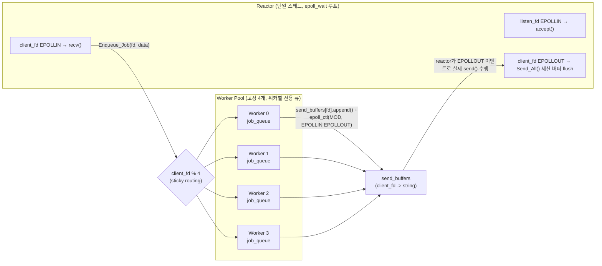
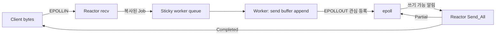
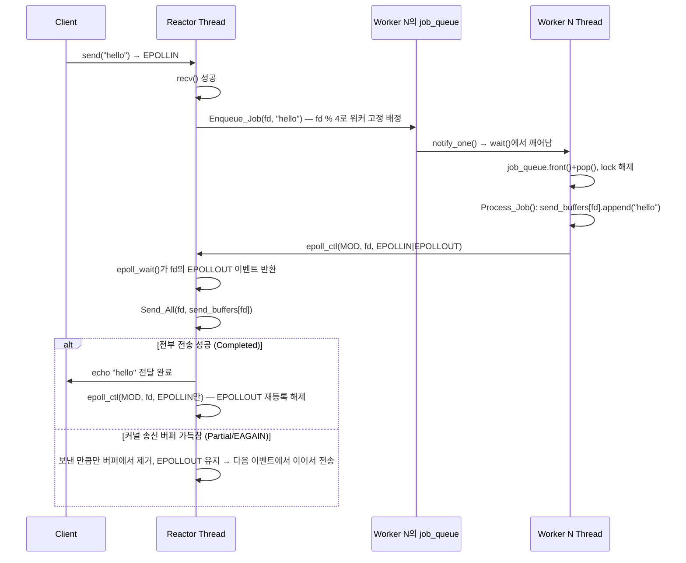

# v5 — 이벤트 루프 + 워커 스레드 풀 결합

## 목표

실제 상용 MMO 서버 구조에 가장 근접한 버전. v3의 고정 thread pool과 v4의 epoll reactor를 결합해,
**reactor는 I/O(accept/recv/EPOLLOUT 기반 송신)만 담당**하고 **워커는 job queue에서 받은 데이터를
세션별 송신 버퍼에 적재하는 역할**로 책임을 분리한다.

## 구성 파일

- [include/epoll_thread_pool_server.h](include/epoll_thread_pool_server.h)
- [src/epoll_thread_pool_server.cpp](src/epoll_thread_pool_server.cpp)
- [src/main.cpp](src/main.cpp)

## 한눈에 보기

| 항목 | 현재 구현 |
|---|---|
| I/O 모델 | 단일 epoll reactor + non-blocking client fd |
| reactor 역할 | accept, recv, `EPOLLOUT` 기반 실제 send |
| worker 역할 | job 처리 후 세션 송신 버퍼 append, `EPOLLOUT` 관심 등록 |
| 작업 분배 | `client_fd % 4` sticky routing, worker별 전용 queue |
| 송신 상태 | `Completed / Partial / Failed` |
| 병목 | 실제 측정에서 단일 reactor thread가 CPU 병목 |

## 핵심 구조

핵심 설계 원칙: **worker는 소켓에 직접 쓰지 않는다.** worker는 `send_buffers`에 데이터를 append하고
`epoll_ctl(EPOLL_CTL_MOD)`로 `EPOLLOUT` 관심만 등록한다. 실제 `send()`는 reactor의 `EPOLLOUT` 핸들러가 전담해
같은 client fd의 송신 주체를 하나로 유지한다.

## 시퀀스: 메시지 하나의 전체 흐름 (recv → job → 워커 → EPOLLOUT → send)

## sticky routing이 필요한 이유

같은 커넥션의 job이 여러 워커에 흩어지면, 클라이언트가 응답을 기다리지 않고 연달아 메시지를 보내는 경우
(pipelining) 세션 버퍼에 append되는 순서가 뒤바뀔 수 있다. `client_fd % kWorkerCounts`로 항상 같은 워커에
라우팅해 한 커넥션의 처리 순서를 보장한다.

## 구현 포인트

- **`SendState` enum (`Completed`/`Partial`/`Failed`)**: `Send_All()`이 `bool` 대신 이 enum을 반환해, non-blocking
  소켓의 `EAGAIN`(아직 다 못 보냄, 정상)과 진짜 에러를 구분한다. `Partial`이면 보낸 만큼만 버퍼에서 지우고 나머지는
  다음 `EPOLLOUT` 이벤트에서 이어 보낸다.
- **`epoll_ctl(EPOLL_CTL_MOD)`는 이벤트를 덮어쓴다**: `EPOLLIN`만 감시하던 fd에 `EPOLLOUT`을 추가하려면
  `EPOLLIN | EPOLLOUT`을 같이 넘겨야 한다. 안 그러면 그 fd는 더 이상 `EPOLLIN`을 못 받는다.
- **워커별 전용 큐 (`Worker` 구조체)**: 전역 job queue 하나 대신 워커마다 `mutex`+`queue`+`condition_variable`
  묶음을 따로 둬서 sticky routing을 구현했다. `Stop()`은 모든 워커의 조건변수를 `notify_all()`해야 한다.
- **`Logging()` 단일 출력 지점**: reactor/워커/monitor 세 종류 스레드가 동시에 `std::cout`을 쓰면 한 줄이 바이트
  단위로 섞인다(부하 테스트에서 fd 값이 `6281472909701472`처럼 깨져서 출력되는 걸 실제로 확인). 호출부가
  `std::ostringstream`으로 한 줄 전체를 완성한 뒤 `log_mutex`로 보호되는 `printf("%s\n", msg.c_str())` 한 번만
  호출하도록 통일했다. (포맷 문자열 취약점을 피하기 위해 포맷 문자열은 `"%s\n"`으로 고정하고 메시지는 인자로만 전달.)
- **`Delete_Client_Fd()`의 중복 호출 안전성**: recv 오류, send 실패, 뒤늦게 도착한 job 등 여러 경로에서 같은 fd로
  호출될 수 있어, `client_fds`/`send_buffers`에서 실제로 지운 경우에만 `epoll_ctl(DEL)`+`close()`를 수행한다
  (fd 재사용 시 엉뚱한 연결을 끊는 이중 close 버그 방지).
- **`std::mutex`는 재귀적으로 잠글 수 없다**: `Delete_Client_Fd()` 내부에서도 `send_mutex`를 잠그기 때문에,
  reactor의 `EPOLLOUT` `Failed` 분기와 `Process_Job()` 모두 `send_mutex`를 쥔 채로 `Delete_Client_Fd()`를
  직접 호출하지 않는다. 대신 락 블록 안에서는 `send_state`/`delete_state` 같은 bool 플래그만 세우고,
  락이 풀린 뒤(블록을 벗어난 뒤)에 그 플래그를 보고 `Delete_Client_Fd()`를 호출해 같은 뮤텍스를 두 번
  잠그는 데드락을 피한다.
- **종료 시 best-effort flush**: `Clean_Up()`은 각 client fd를 닫기 전에 남은 `send_buffers` 데이터를 `Send_All()`로
  한 번 더 시도한다. 무한정 기다리지도, 그냥 버리지도 않는 절충.

## 테스트/QA

- 빌드 `-Wall -Wextra` 경고 없음, 단일/동시 접속 echo, `SIGTERM` graceful shutdown 확인
- 부하: 50 clients × 20 msg 1000/1000, 2000 clients × 20 msg(40,000 echo) 순간 부하 40000/40000,
  300 clients 30초 지속 부하 3000/3000 전부 성공
- `top -H` 스레드별 CPU 측정: job queue 자체는 병목이 아니고(`Queued: 0` 대부분), reactor 스레드 하나가 모든
  I/O를 처리하는 구조 자체가 병목 — v5가 의도한 설계("reactor는 I/O만 담당")의 당연한 한계
- AddressSanitizer + LeakSanitizer: 120개 연결·1800개 echo 반복 후 메모리 누수/안전성 에러 없음

## 이 구조의 한계 (v6/v7과의 관계)

- 배포 타겟(Linux) 기준으로는 v5가 현재까지의 완성형 구조다. reactor 스레드 하나가 모든 I/O를 처리하는 것이
  다음 개선 방향(예: 다중 reactor)이 될 수 있다.
- v6/v7은 이 Linux epoll 트랙과는 별개로, **Windows IOCP**의 completion 기반 비동기 I/O 모델을 비교 학습하기
  위한 트랙이다 (native Windows + Visual Studio, WSL2에서는 IOCP 사용 불가).
