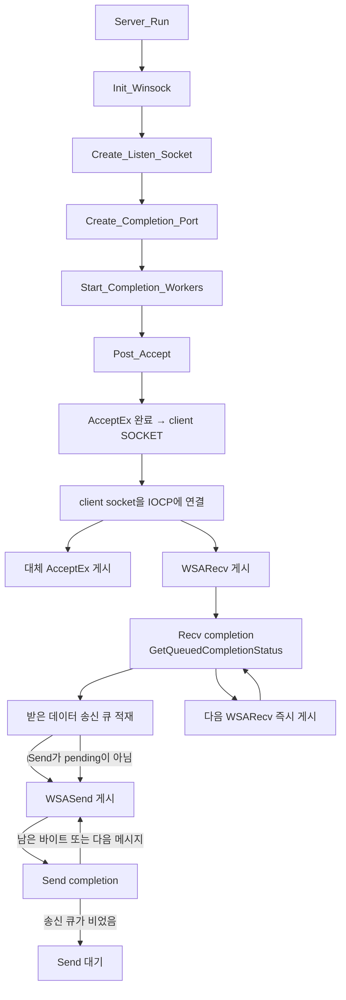
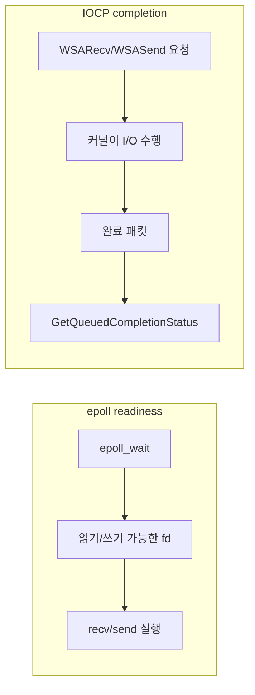
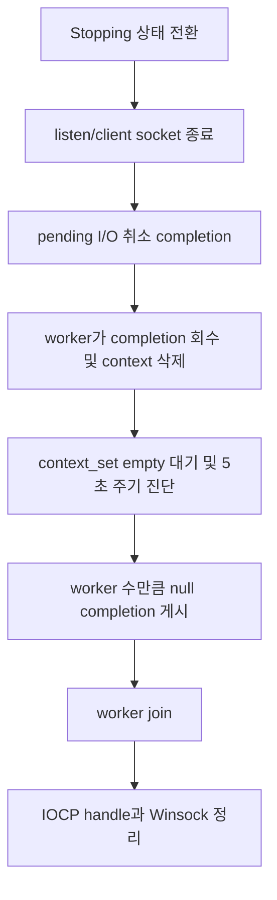

# v6 — Windows IOCP 기반 비동기 I/O 서버

> 현재 상태: 완료

## 목표

Windows의 IOCP를 이용해 **I/O를 먼저 요청하고 나중에 완료 결과를 받는 completion 모델**을 익힌다.
v4~v5의 Linux `epoll` readiness 모델과 같은 echo 시나리오를 구현해 두 모델의 차이를 비교한다.

## 구성 파일

- [include/iocp_echo_server.h](include/iocp_echo_server.h)
- [src/iocp_echo_server.cpp](src/iocp_echo_server.cpp)
- [src/main.cpp](src/main.cpp)
- [CMakeLists.txt](CMakeLists.txt)

## 현재 구현 상태

| 단계 | 상태 | 현재 내용 |
|---|---|---|
| Winsock 초기화 | 완료 | Winsock 2.2 초기화와 중복 초기화 방지 |
| listen socket | 완료 | `WSASocket()`과 `WSA_FLAG_OVERLAPPED`, bind/listen |
| completion port 생성 | 완료 | 빈 IOCP handle 생성 후 listen/client socket 연결 |
| completion worker | 완료 | 논리 코어 수 기준 worker와 `GetQueuedCompletionStatus()` 루프 |
| 비동기 accept | 완료 | Accept context 16개 선게시, 완료마다 대체 accept 게시 |
| client IOCP 등록 | 완료 | accept 완료 socket을 기존 IOCP handle에 연결 |
| 비동기 echo | 완료 | Recv/Send 동시 진행, 세션별 순서 보장 송신 큐, partial send 처리 |
| context 수명 | 완료 | 세션과 작업별 context 분리, `CONTAINING_RECORD`로 completion 복원 |
| 로그 | 완료 | `Info` 생명주기, `Debug` 연결/I/O 흐름, `Error` API 실패 구분 |
| 종료와 정리 | 완료 | pending I/O 취소·5초 주기 진단·drain, 종료 completion, worker join, handle 정리 |

## 핵심 객체와 소유권

- `ClientSession`
  - client socket과 세션별 송신 큐를 소유한다.
  - `socket_mutex`로 I/O 게시와 socket 종료가 겹치지 않게 한다.
  - `send_mutex`, `send_pending`, `send_offset`으로 한 세션당 하나의 Send만 pending 상태로
    유지하면서 받은 순서대로 echo한다.
- `IoContext`
  - Accept, Recv, Send 중 하나의 pending overlapped 작업을 표현한다.
  - Recv context는 독립 수신 버퍼를, Send context는 세션과 논리적 남은 송신 길이를 가진다.
  - `shared_ptr<ClientSession>`으로 completion이 도착할 때까지 세션 수명을 유지한다.
- `pending_contexts`
  - Windows가 아직 `OVERLAPPED`를 참조할 수 있는 context를 추적한다.
  - worker가 completion을 받은 뒤에만 목록에서 제거하고 context를 삭제한다.

## 현재 정상 실행 흐름

현재 정상 실행 흐름은 다음과 같다.



Recv context와 Send context가 분리되어 있어 이전 Send가 끝나기 전에도 다음 Recv를 게시할 수
있다. 단, TCP echo 순서는 세션별 송신 큐와 `send_pending`으로 보장한다.

## epoll과 IOCP의 관점 차이



## 종료 흐름



취소 요청 직후 context를 직접 삭제하지 않는다. socket을 닫으면 취소된 작업도 completion으로
돌아오므로, worker가 모든 completion을 회수해 `pending_contexts`가 빌 때까지 기다려야 한다.
5초 동안 변화가 없으면 남은 context 수를 출력하지만 안전하지 않은 강제 삭제는 하지 않는다.

## 로그 레벨

| 레벨 | 용도 | 예시 |
|---|---|---|
| `Info` | 서버 생명주기와 운영 요약 | 시작, Winsock/IOCP 준비, worker 수, 초기 Accept 수, drain, 종료 |
| `Debug` | 연결 및 completion 흐름 관찰 | Accept 게시/완료, Recv/Send 게시·완료, partial send, 활성 세션 수 |
| `Error` | 실행 중 실제 API 실패와 종료 지연 | `WSARecv`, `WSASend`, `AcceptEx`, IOCP 실패, drain 대기 진단 |

기본 `minimum_log_level`은 `Info`다. 연결별 상세 로그가 필요한 학습·디버깅 상황에서는
`Debug`로 낮출 수 있고, 부하 측정에서는 기본값을 유지해 콘솔 출력 영향을 줄인다. 여러 worker의
출력은 `log_mutex`로 한 줄씩 직렬화한다.

## 빌드와 실행

native Windows의 Visual Studio C++ 도구와 CMake가 필요하다. 저장소 루트에서 실행한다.

```powershell
cmake -S server -B server/build
cmake --build server/build --config Debug
.\server\build\v6\v6_server.exe
```

서버는 TCP 9000번 포트에서 실행되며 Enter를 누르면 `Stop()`을 호출하고 서버 스레드를 join한다.
MSVC에서는 `/W4`, C++20과 함께 한국어 학습 주석을 안전하게 읽도록 v6 타깃에 `/utf-8`을 적용한다.

부분 전송 continuation을 결정적으로 확인하려면 별도 빌드를 사용한다.

```powershell
cmake -S server -B server/build-partial -DV6_FORCE_PARTIAL_SEND_TEST=ON
cmake --build server/build-partial --config Debug
.\server\build-partial\v6\v6_server.exe
```

이 옵션은 테스트 빌드에서 socket send buffer와 한 번의 `WSASend()` 요청을 1 KiB로 제한한다.
운영용 일반 빌드에는 켜지 않는다.

## 검증 결과

- native Windows, MSVC C++20 일반 빌드 및 링크 성공(`/W4` 경고 없음)
- 200 clients × 10 msg에서 2000/2000 echo 성공
- pending `WSARecv()` 상태에서 종료 시 completion drain, worker 16개 join, 종료 코드 0 확인
- MSVC AddressSanitizer 빌드에서 50 clients × 20 msg(1000/1000) 및 같은 종료 시나리오 성공
- `V6_FORCE_PARTIAL_SEND_TEST=ON` 빌드에서 느린 수신 client의 4 MiB echo 일치 및
  send continuation 4,032회 확인
- 주석·로그 추가 후 20 clients × 10 msg(200/200), 필수 생명주기 로그, stderr 없음과
  정상 종료를 다시 확인
- TPS, 요청별 지연시간, 메모리 사용량은 아직 측정하지 않음

## 현재 구조의 범위

- 작업별 context는 pending I/O 하나만 소유하며, 세션은 socket과 순서 보장 송신 큐를 소유한다.
- Accept context 16개를 선게시하며, 수신과 송신은 동시에 진행할 수 있다.
- 기본 로그 레벨은 `Info`이며 연결 단위 상세 로그는 `Debug`에서만 출력한다.
- 받은 TCP 바이트를 그대로 반환하는 echo 서버로, 패킷 framing과 게임 로직은 v7 이후 범위다.
- 송신 큐 크기 제한과 backpressure 정책은 아직 없으므로 느린 client가 계속 데이터를 보내는
  운영 시나리오는 이후 버전에서 별도로 설계해야 한다.
